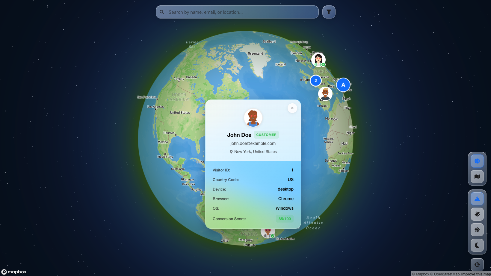

# Mapbox Globe Viewer

React application with 3D globe visualization using Mapbox GL JS.



## Features

- 3D globe and 2D flat map projections
- Marker clustering with use-supercluster
- Search and filtering (country, device, customer type, country code)
- Multiple map styles (Outdoors, Satellite, Light, Dark)
- Dark mode toggle based on map style

## Setup

**Prerequisites:** Node.js 16+, Mapbox access token

1. Install dependencies:
   ```bash
   npm install
   ```

2. Set Mapbox token in `.env`:
   ```bash
   VITE_MAPBOX_TOKEN=your-token-here
   ```

3. Start dev server:
   ```bash
   npm run dev
   ```

## 📁 Project Structure

```
mapbox-globe-viewer/
├── src/
│   ├── components/       # React components
│   │   ├── ClusterMarker/    # Cluster marker component
│   │   ├── FilterPanel/       # Filter panel component
│   │   ├── Marker/            # Individual marker component
│   │   ├── Popup/             # Popup component
│   │   ├── SearchBar/          # Search bar component
│   │   ├── SearchFilterBar/   # Search and filter container
│   │   └── ViewControls/      # Map view controls
│   ├── constants/        # Application constants
│   │   └── index.js           # Map styles, configs, etc.
│   ├── hooks/            # Custom React hooks
│   │   ├── useClustering.js   # Marker clustering logic
│   │   ├── useMapConfig.js    # Map style configuration
│   │   └── useVisitorFilters.js # Filtering logic
│   ├── utils/            # Utility functions
│   │   ├── conversionScore.js # Conversion score utilities
│   │   └── visitorFilters.js  # Filter utility functions
│   ├── App.jsx           # Main application component
│   ├── App.css           # Main app styles
│   ├── main.jsx          # React entry point
│   ├── index.css         # Global styles
│   └── sampleData.js     # Sample visitor data
├── index.html            # HTML template
├── package.json          # Dependencies and scripts
├── vite.config.js        # Vite configuration
├── ARTICLE.md           # Comprehensive Mapbox GL JS guide
└── README.md            # This file
```

## Documentation

See **[ARTICLE.md](./ARTICLE.md)** for Mapbox GL JS concepts and implementation details.

## Core Concepts

- **Globe Projection**: `projection="globe"` for 3D sphere view
- **Marker Clustering**: Uses `use-supercluster` for performance
- **Map Styles**: Outdoors, Satellite, Light, Dark
- **View Modes**: Toggle between globe and mercator projections

## Data Format

```javascript
{
  visitorId: 'unique-id',
  firstName: 'John',
  lastName: 'Doe',
  email: 'john@example.com',
  latitude: 40.7128,
  longitude: -74.0060,
  city: 'New York',
  country: 'United States',
  countryCode: 'US',
  profileImage: 'https://...', // Optional
  isCustomer: true,            // Optional
  device: { type: 'desktop' }, // Optional
  browser: { name: 'Chrome' },  // Optional
  os: { name: 'Windows' },      // Optional
  conversionLikelihood: { score: 85 } // Optional
}
```

## Customization

**Map Styles:** Configure in `src/constants/index.js`

**Adding Custom Style:**
1. Create style in Mapbox Studio
2. Add to `MAP_STYLES` and `MAP_STYLE_TYPES` in `src/constants/index.js`
3. Add fog color to `FOG_COLORS` if using globe projection

**Component Styles:** Located in respective component directories (`src/components/*/`)

## Dependencies

- react (^18.2.0)
- react-dom (^18.2.0)
- react-map-gl (^7.1.7)
- mapbox-gl (^3.0.1)
- use-supercluster (^1.2.0)
- react-icons (^5.5.0)
- vite (^5.0.8)

## Scripts

- `npm run dev` - Development server
- `npm run build` - Production build
- `npm run preview` - Preview production build

## Troubleshooting

**Map not displaying:** Check Mapbox token validity and browser console

**Markers not appearing:** Verify coordinates are valid (-90 to 90 lat, -180 to 180 lng) and within viewport

**Build errors:** Clear `node_modules` and reinstall, verify Node.js 16+

## 📝 License

MIT License - feel free to use this project for your own purposes.

## Architecture

- **Components**: UI components (`src/components/`)
- **Hooks**: Business logic (`src/hooks/`)
- **Constants**: Configuration (`src/constants/`)
- **Utils**: Utility functions (`src/utils/`)

## License

MIT
